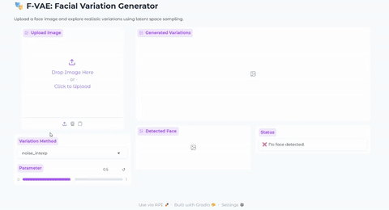

# 🎭 F-VAE: Facial Variation Generator

Upload a face image and explore different variations through various latent space sampling techniques.


<p align="center">
    
</p>


<div align="center">This task uses a pretrained VAE that can be found 
<a href = "https://github.com/moshesipper/vae-torch-celeba?tab=readme-ov-file"> Here </a> </div>

---

<p align="center">

| [✨ Features](#-features) | [📁 Project Structure](#-project-structure) | [🚀 How to use](#-how-to-use) | [🔀 Variation Methods](#-variation-methods) | [🙏 Acknowledgments](#-acknowledgments) |
| ---- | ---- | ---- | ---- | ---- |


</p>


<div id = "features">

## ✨ Features

- **Multiple Variation Methods**: Choose from three different approaches to generate facial variations:
  - **Noise Interpolation**: Smooth interpolation between original face and random noise `Recommended Variation`
  - **Latent Walk**: Linear walks through latent space
  - **Noise Ramp**: Non linear noise injection for controlled variation
- **Real-time Face Detection**: Automatic face detection and cropping using MTCNN
- **Interactive Web Interface**: User-friendly Gradio interface with real-time parameter adjustment
- **Image Enhancement**: Post-processing filters for improved output quality

</div>


<div id = "-project-structure">

## 📁 Project Structure

```
Facial-Generation/
├── app.py                 # Gradio application
├── functions.py           # processing functions
├── vae.py                # VAE model architecture
├── VAE_Walkthrough.ipynb # Jupyter notebook with examples
├── requirements.txt      # Python dependencies
├── pretrained_weights/   
│   └── vae_model_20.pth  # Pretrained VAE model
└── README.md            
```
</div>

<div id = "-how-to-use">

## 🚀 How to use

1. **Clone the repository**
   ```bash
   git clone <repository-url>
   cd F-VAE
   ```

2. **Install dependencies**
   ```bash
   pip install -r requirements.txt
   ```

3. **Download pretrained weights**
   - Ensure the `pretrained_weights/` directory contains the VAE model file `vae_model_20.pth`

### Usage

1. **Launch the web interface**
   ```bash
   python app.py
   ```

2. **Open your browser**
   - Navigate to the URL shown in the terminal (usually `http://127.0.0.1:7860`)

3. **Generate facial variations**
   - Upload a face image
   - Select a variation method
   - Adjust the parameter slider
   - View the generated variations in real-time

</div>

<div id = "-variation-methods">

## 🔀 Variation Methods

1. **Noise Interpolation (α parameter)**
   - Interpolates between the original face encoding and random noise
   - α = 0: Original face, α = 1: Random face

2. **Latent Walk (Walk Scale parameter)**
   - Linear walk through latent space
   - Controls the magnitude of the walk

3. **Noise Ramp (Ramp Power parameter)**
   - Non linear noise injection
   - Higher powers create more dramatic variations

</div>

<div id = "-acknowledgments">

## 🙏 Acknowledgments

- VAE implementation based on [PyTorch-VAE](https://github.com/AntixK/PyTorch-VAE)
- Face detection using [facenet-pytorch](https://github.com/timesler/facenet-pytorch)
- Web interface powered by [Gradio](https://gradio.app/)

</div>

---

